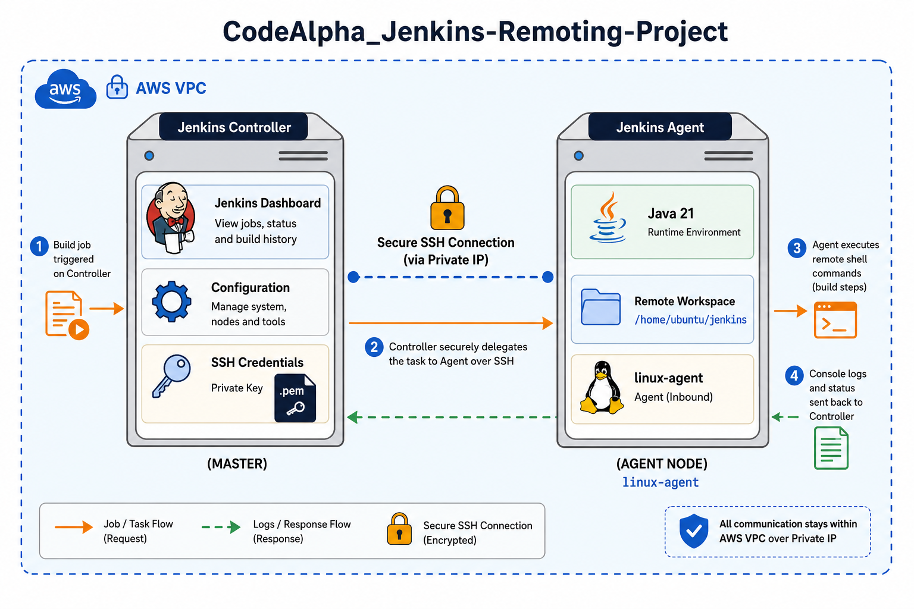

# CodeAlpha Jenkins Remoting Project

## 📌 Project Overview


Running heavy builds directly on a main Jenkins server (the Controller) poses a major risk in production environments. If a build consumes all the CPU or crashes the machine, the entire CI/CD pipeline goes down for the whole team. 

This project solves that by implementing a **Master-Agent (Controller-Worker) architecture**. In this setup, Jenkins acts purely as a project manager, securely delegating the heavy lifting to remote, disposable Ubuntu worker servers over a private network.

### 🎯 Objectives Achieved
* Set up Jenkins Remoting to connect remote Linux worker nodes.
* Distributed build loads securely across an internal AWS VPC network.
* Improved security through strict node isolation and SSH key verification.
* Executed shell commands remotely via automated Jenkins jobs.

---

## 🏗️ Architecture & Technologies Used
* **Cloud Provider:** AWS (Amazon Web Services)
* **Infrastructure as Code:** Terraform
* **Servers:** 2x Ubuntu 22.04 LTS instances (t3.micro)
* **CI/CD Platform:** Jenkins
* **Environment:** Java 21
* **Security:** AWS Security Groups, RSA Private Keys, Private IP routing

---

## 🚀 Step-by-Step Setup & Execution Guide

### Phase 1: Infrastructure Provisioning (Terraform)
The infrastructure is fully modularized using Terraform. The scripts generate a local RSA SSH key, lock down the network firewalls (allowing only internal SSH traffic from the Controller to the Agent), and provision the EC2 instances.

To deploy the infrastructure, run:
```bash
terraform init
terraform plan
terraform apply --auto-approve
```

### Phase 2: Server Configuration
Both servers must run the exact same Java version (Java 21) to ensure the Jenkins Remoting protocol functions correctly.

**On the Jenkins Controller:**
```bash
# Install Java 21
sudo apt update && sudo apt install openjdk-21-jre -y
```


```bash
# Install Jenkins
sudo wget -O /usr/share/keyrings/jenkins-keyring.asc https://pkg.jenkins.io/debian-stable/jenkins.io-2023.key
echo "deb [signed-by=/usr/share/keyrings/jenkins-keyring.asc]" https://pkg.jenkins.io/debian-stable binary/ | sudo tee /etc/apt/sources.list.d/jenkins.list > /dev/null
sudo apt-get update && sudo apt-get install jenkins -y
```

### Phase 3: Jenkins Node Integration
To link the Controller to the Agent securely without exposing the worker to the public internet:
1. Navigate to **Manage Jenkins** > **Nodes** > **New Node**.
2. Configure a permanent agent named `jenkins-agent-1` with the label `linux-agent`.
3. Set the remote root directory to `/home/ubuntu/jenkins`.
4. Target the worker's **Private IP** address (`10.0.1.x`) via the SSH launch method.
5. Inject the Terraform-generated `.pem` private key as an SSH credential in Jenkins.
6. Launch the agent.

### Phase 4: Remote Execution Verification
To prove the architecture successfully distributes workloads:
1. Created a Jenkins Freestyle Project named `CodeAlpha-Task2-Test`.
2. Restricted the project execution strictly to the `linux-agent` label.
3. Added an `Execute shell` build step with commands to verify the server identity (`hostname -I` and `whoami`).

**Result:** The Jenkins Controller successfully established an SSH connection, initialized the remote workspace, and executed the job. The console output returned the remote agent's private IP, confirming the Master-Agent architecture is fully functional and secure.